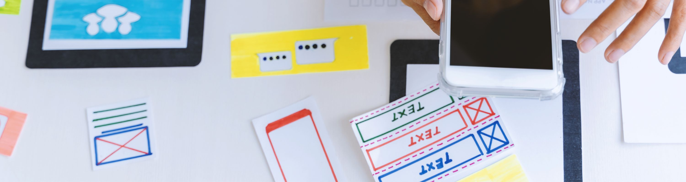

---
hide:
  - navigation
---
# **Órbita 1: Diseñar para que funcione** **Introducción**

# **6\. MVP: centrarse en lo esencial**

Una vez que hemos definido la arquitectura de la información, diseñado los wireframes y creado un prototipo navegable que represente el flujo funcional de nuestra aplicación, es el momento de tomar una decisión estratégica: **¿qué funcionalidades deben implementarse primero?**

En esta etapa, entra en juego el concepto de **MVP**, siglas de *Minimum Viable Product*, que podríamos traducir como “Producto Mínimo Viable”. Aunque proviene del mundo del desarrollo ágil y las startups, este concepto es perfectamente aplicable a proyectos educativos y de diseño, ya que nos obliga a **priorizar lo funcional frente a lo estético** y lo imprescindible frente a lo accesorio.

## **¿Qué es exactamente un MVP?**

Un MVP es una versión funcional de una aplicación que incluye **solo las funcionalidades mínimas necesarias para que el usuario pueda completar su objetivo principal**. No se trata de un prototipo estático ni de una maqueta visual, sino de una simulación funcional que, aun con diseño básico, permite al usuario realizar una tarea significativa.

El propósito del MVP no es demostrar lo bonito que puede ser el producto final, sino **validar si la solución propuesta tiene sentido, si es comprensible y si realmente resuelve el problema del usuario**.

En contextos reales, lanzar un MVP permite recoger feedback temprano, corregir errores y evitar perder tiempo desarrollando funcionalidades que el usuario tal vez no necesita. En nuestro caso, nos sirve para comprobar si el diseño funcional que hemos planificado es claro, lógico y eficiente.

## **¿Por qué es tan importante en el diseño funcional?**

El MVP es una herramienta poderosa para enfocar el diseño desde la funcionalidad. Su valor reside en varios aspectos clave:

* **Evita sobrecargar el diseño y desarrollo inicial** con funcionalidades que pueden esperar.
* **Permite validar decisiones funcionales** sin depender aún de un diseño visual definitivo.
* **Fomenta la iteración** basada en pruebas reales y no en suposiciones.
* **Ahorra tiempo y recursos**, algo especialmente útil en proyectos educativos con plazos y recursos limitados.

Un buen MVP no es una versión “recortada” de la app final. Es una **versión estratégica**, pensada para cumplir el objetivo principal del usuario con la mayor claridad posible.

## **¿Cómo definimos un MVP?**

La clave para definir un MVP es **tener claridad sobre qué quiere lograr el usuario y qué necesita como mínimo para lograrlo**. Esto se puede abordar en varias fases:

1. **Identificar el objetivo principal del usuario**  
   Preguntarse: ¿Qué tarea quiere realizar el usuario? ¿Cuál es el núcleo de la experiencia?

2. **Dibujar el flujo mínimo funcional**  
   ¿Qué pasos necesita seguir el usuario, desde el inicio hasta lograr su objetivo? Eliminar todo lo que no sea imprescindible.

3. **Filtrar funciones secundarias**  
   Hacer una distinción clara entre lo esencial (que sí entra en el MVP) y lo accesorio (que puede añadirse más adelante).

4. **Validar el flujo con el usuario o con otros grupos**  
   Comprobar si se entiende, si funciona y si permite completar la tarea sin bloqueos.

## **Ejemplo práctico: app de recetas**

Imaginemos que estamos diseñando una app de recetas.

**Objetivo principal del usuario**: encontrar una receta y leerla con claridad.

**MVP mínimo**:

* Pantalla con buscador de recetas.
* Listado de resultados.
* Ficha de receta con ingredientes y pasos.

**Lo que no entra en el MVP**:

* Registro de usuario.
* Subida de recetas.
* Guardar favoritas.
* Valoraciones o comentarios.

Aunque estas funciones serán útiles más adelante, no son necesarias para que el usuario logre su objetivo principal en esta primera versión.

## **¿Qué se entrega como MVP en esta órbita?**

En el proyecto práctico asociado a esta órbita, se pide al alumnado que construya y documente su MVP a través de los siguientes elementos:

* **Mapa del flujo MVP**, representado en Miro, Figma o incluso en papel digitalizado. Debe mostrar claramente los pasos que sigue el usuario.

* **Tabla de funcionalidades**, donde se especifique qué entra en el MVP y qué se pospone para futuras versiones. Esta tabla debe ir acompañada de una breve justificación de las decisiones tomadas.

* **Prototipo navegable en Figma** del MVP. Debe incluir como mínimo **tres pantallas funcionales enlazadas**, que permitan simular la experiencia del usuario realizando su tarea principal.

## **Recursos recomendados para ampliar**

## **Actividad práctica en clase**

**Título**: *“Priorizar para construir”*

**Objetivo**: Aprender a definir el MVP de una aplicación y justificarlo desde la funcionalidad.

**Desarrollo**:

1. Cada persona parte de su mapa de navegación y wireframes previos.
2. Identificaréis el objetivo principal del usuario en su app.
3. Elaboraréis una tabla que diferencie:
  * Funcionalidades esenciales (incluidas en el MVP)
  * Funcionalidades complementarias (para versiones futuras)
4. Representaréis el flujo MVP en una herramienta de su elección.
5. Presentaréis el flujo y la tabla, justificando qué entra y por qué.

Esta actividad refuerza la idea de que el diseño no debe nacer desde la ambición estética o la acumulación de ideas, sino desde una estrategia funcional clara y enfocada en el usuario.

